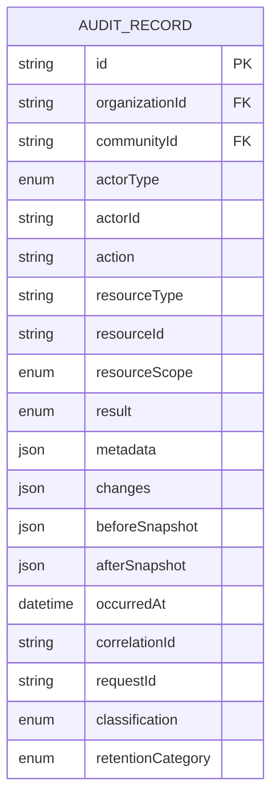

# Enterprise Audit Engine Architecture

## 1. Executive Summary

The Community OS **Audit Engine** provides an append-only, tamper-evident, tenant-isolated ledger recording every meaningful administrative, security, and domain event across the platform.

It answers the fundamental compliance question:

> **WHO** did **WHAT** to **WHICH RESOURCE** inside **WHICH TENANT** when, from **WHICH SESSION/REQUEST**, with what **CHANGES** and what **RESULT**.

---

## 2. Core Architectural Principles

1. **Append-Only & Immutable**:
   - Audit records cannot be modified (`PATCH`/`PUT`) or deleted (`DELETE`) via application APIs.
   - Database operations are restricted to `INSERT` and `SELECT`.
2. **Domain Event Driven**:
   - All domain operations emit strongly-typed domain events through the `EventBus`.
   - The `AuditEventSubscriberService` automatically projects domain events into structured `AuditRecord` entries asynchronously.
3. **Sensitive Field Redaction**:
   - Recursive masking sanitizes sensitive fields (e.g. `password`, `refreshToken`, `otp`, `apiKey`, `secretKey`, `token`) in metadata, snapshot before/after payloads, and change diffs before persistence.
4. **Formula Injection Defense**:
   - All CSV exports sanitize text cells starting with formula characters (`=`, `+`, `-`, `@`) by prepending a single quote `'` to neutralize spreadsheet script execution.
5. **Tenant Scoping & Multi-Tenancy**:
   - Every audit record records `organizationId`, `communityId`, and `resourceScope` (`PLATFORM`, `ORGANIZATION`, `COMMUNITY`).
   - Query APIs strictly isolate logs based on actor tenant membership and role permissions (`audit.view`, `audit.view_sensitive`, `audit.export`).

---

## 3. Data Model & Lifecycle

---

## 4. Retention Categories

Audit records are classified into 5 regulatory retention categories:

- **SECURITY**: IAM, authentication, session lifecycle, role assignments (Retention: 7 years).
- **FINANCIAL**: Billing, transactions, invoices, payment receipts (Retention: 10 years).
- **GOVERNANCE**: Bylaws, AGM voting, committee resolutions, master property deeds (Retention: Permanent).
- **OPERATIONAL**: Move-in/move-out events, facility bookings, notices (Retention: 3 years).
- **SYSTEM**: Health checks, automated background jobs (Retention: 1 year).
