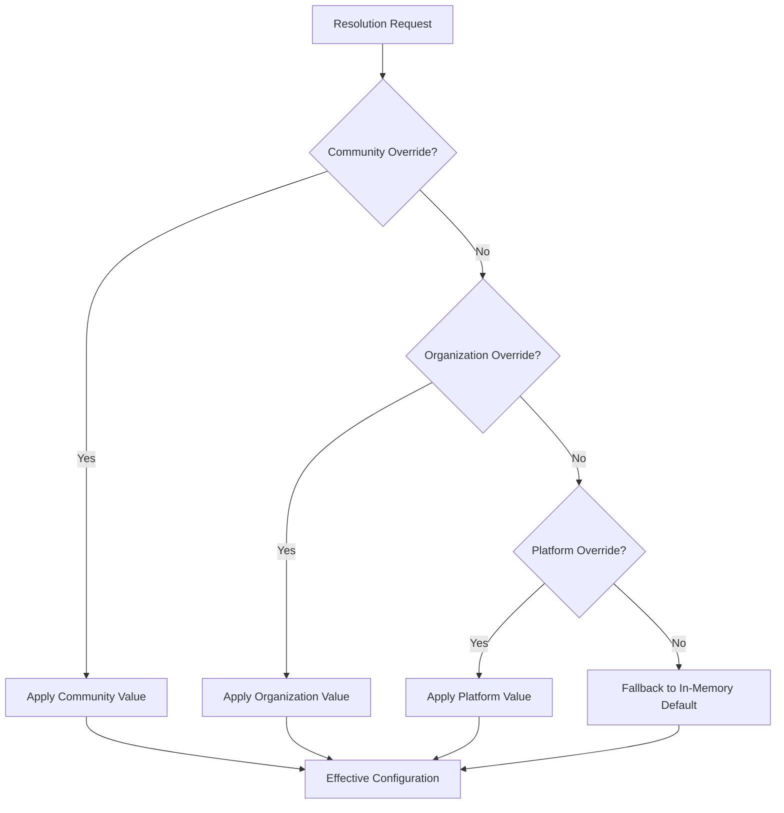

# Configuration Engine Architecture

## Overview

The Community OS **Configuration Engine** provides a typed, hierarchical, and auditable configuration platform enabling multi-tenant organizations and communities to customize operational parameters without code modifications or forks.

## Core Components

1. **`ConfigurationRegistry`**: In-memory static catalog of canonical configuration keys defining:
   - `key`: Unique dot-notated identifier (e.g. `community.display.unitLabel`).
   - `namespace`: Category grouping (`platform`, `iam`, `property`, `resident`, `notifications`, `audit`, `finance`).
   - `valueType`: `STRING`, `NUMBER`, `BOOLEAN`, `JSON`, `ENUM`.
   - `defaultValue`: Fallback value when no override is present.
   - `allowedScopes`: Restricts where an override can be configured (`PLATFORM`, `ORGANIZATION`, `COMMUNITY`).
   - `sensitivity`: `PUBLIC_CLIENT`, `TENANT_INTERNAL`, `ADMIN_ONLY`, `RESTRICTED`.

2. **`ConfigurationRepository`**: Database repository managing `ConfigurationOverride` records with optimistic concurrency control (`expectedVersion`).

3. **`ConfigurationResolverService`**: Evaluates effective values across the scope hierarchy with Redis caching (`300s` TTL) and automated cache eviction upon updates.

4. **`ConfigurationService` & `ConfigurationController`**: Public API and management service emitting domain events (`configuration.override_created.v1`, `configuration.override_updated.v1`, `configuration.override_removed.v1`) and enforcing scoped RBAC permissions (`config.view`, `config.manage`).
