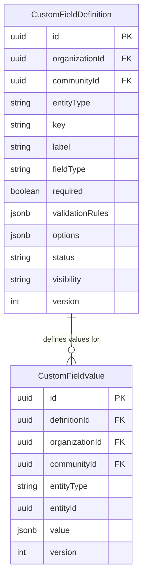

# Dynamic Custom Fields Architecture

## Overview

The **Custom Fields Engine** enables tenants to capture community-specific metadata across core platform domain entities (`COMMUNITY`, `BUILDING`, `UNIT`, `RESIDENT`, `HOUSEHOLD`, `DOCUMENT`) without modifying database schemas.

## Data Model

## Validation & Lifecycle

- **Server-Side Validation**: Values are validated on the backend against the field definition type and `validationRules` (regex patterns, numeric ranges, date bounds, select options).
- **Immutability**: `fieldType` is immutable after creation to protect historical data integrity.
- **Soft Deletion / Archival**: Field definitions can be transitioned to `ARCHIVED`, preserving historical values on existing entity instances while hiding the field from new entry forms.
