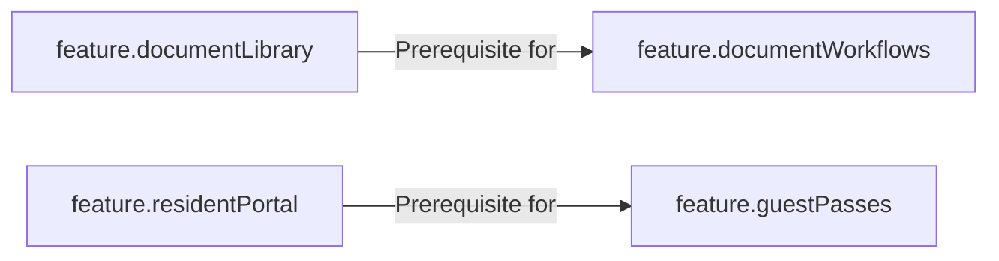

# Feature Flags & Entitlements Engine

## Overview

The **Feature Flags Engine** provides commercial entitlement gating and operational feature toggling across Platform, Organization, and Community scopes.

Feature evaluation is strictly independent of user authorization:

$$\text{Capability Access} = \text{Feature Enabled}(\text{Tenant Context}) \land \text{User Authorized}(\text{Actor, RBAC})$$

## Feature Dependency Resolution

Features can declare prerequisites in `dependencies`. When resolving effective features:

- If any prerequisite feature is disabled, the child feature is automatically evaluated as `enabled: false`.
- The resolver returns `dependenciesMet: false` along with the prerequisite failure reason.

## Security & Client Safety

Feature definitions flag client visibility with `isClientSafe`. Client applications (such as mobile or public web portals) query `/api/v1/features/effective` to safely discover active capabilities without exposing internal backend operational flags.
