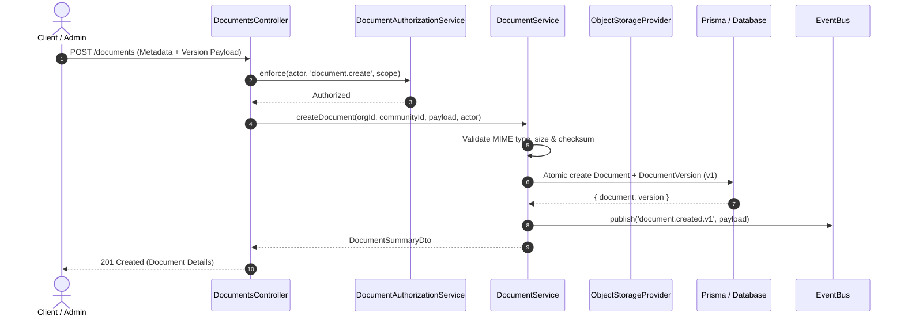

# File Upload & Ingestion Lifecycle

## 1. Upload Flow

## 2. Authorized Streaming Download Flow

1. Client requests `GET /documents/:id/download?version=N`.
2. `DocumentsController` resolves requested `Document` and target `DocumentVersion`.
3. `DocumentAuthorizationService` verifies actor has tenant access and clearance for the document's `classification` (`PUBLIC`, `INTERNAL`, `CONFIDENTIAL`, `RESTRICTED`).
4. Verifies version status is `ACTIVE` (rejects `QUARANTINED` files).
5. `ObjectStorageProvider` opens readable stream for the `storageKey`.
6. API pipes stream directly to client response with proper `Content-Type` and `Content-Disposition: attachment; filename="..."` headers without loading entire binary into server RAM.
