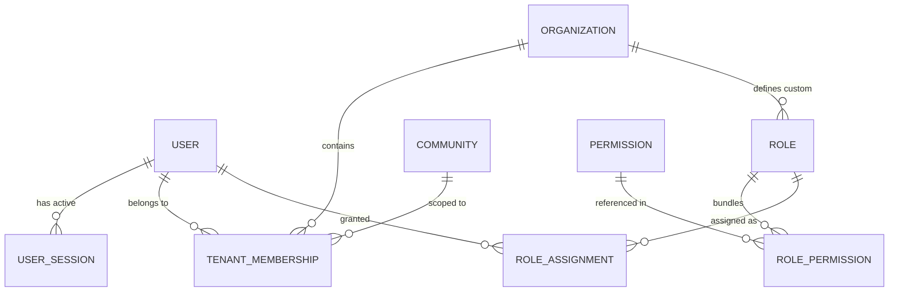

# Identity & Access Management (IAM) Architecture

## 1. Executive Summary

Community OS Phase 2 implements a unified, multi-tenant IAM subsystem supporting:

- Centralized user identities across the platform.
- Scoped tenant memberships connecting users to organizations and communities.
- Fine-grained Scoped RBAC (`SUBJECT + RESOURCE + ACTION + SCOPE`).
- Server-side revocable session tracking with refresh token rotation.
- Enterprise security controls and privilege escalation guards.

---

## 2. Core IAM Data Entities

1. **`User`**: Global human or system identity (email, phone, credentials, locale, status).
2. **`UserSession`**: Device session records with revocable token hash, IP, and user-agent.
3. **`TenantMembership`**: Multi-tenant association linking a User to an Organization and optionally a Community.
4. **`Role`**: Named bundle of granular system permissions, scoped to PLATFORM, ORGANIZATION, or COMMUNITY.
5. **`Permission`**: Atomic capability code (`resource.action`).
6. **`RoleAssignment`**: Binding an actor (User) to a Role with an explicit Scope boundary (`PLATFORM`, `ORGANIZATION`, `COMMUNITY`, `OWN`).
