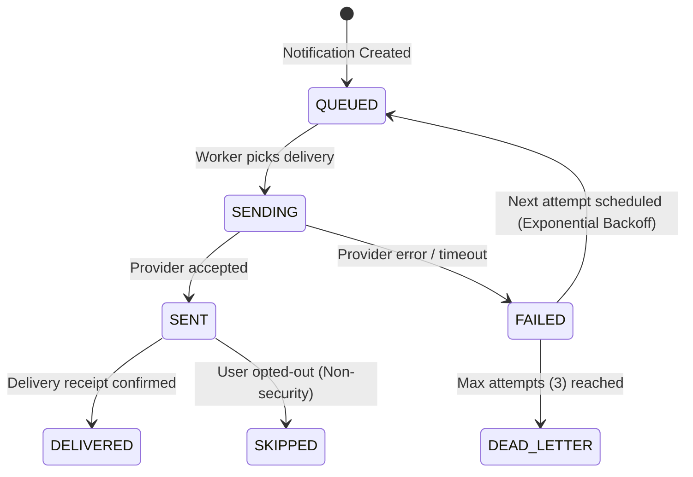

# Multi-Channel Notification Engine Architecture

## 1. Executive Summary

The Community OS **Notification Engine** is a centralized platform service responsible for multi-channel message dispatch, in-app notification inbox delivery, template rendering with safe variable substitution, recipient preference resolution, and resilient retry delivery workers.

---

## 2. Notification Channels & Providers

The system supports 6 delivery channels:

1. **IN_APP**: Real-time persisted in-app notifications with unread counts, badges, and read-receipt lifecycle.
2. **EMAIL**: Transactional email dispatch with SPF/DKIM validation support (Local development uses `LogSinkEmailProvider`).
3. **SMS**: Text messaging provider for OTPs and urgent emergency alerts (Local development uses `LogSinkSmsProvider`).
4. **PUSH**: Mobile APNs / FCM push notifications (Local development uses `LogSinkPushProvider`).
5. **WHATSAPP**: Messaging API integration for resident notices and billing alerts.
6. **WEBHOOK**: Outgoing webhook dispatch to external property management systems.

---

## 3. Delivery Pipeline & State Machine

---

## 4. Preference Hierarchy

Before queuing a delivery for a user on a given channel, the `NotificationService` resolves preferences according to the following strict hierarchy:

1. **Mandatory Security Policy**: Security, authentication, and emergency notices (`SECURITY` category or `CRITICAL` priority) **cannot be disabled** by users or tenant policies.
2. **Tenant Community Policy**: Property management overrides for required building notices.
3. **Category System Default**: Default enabled channels per notification category.
4. **User Explicit Preference**: Resident's individual preferences configured per channel and category in `NotificationPreference`.

---

## 5. Safe Template Engine

- Variable substitution uses double-brace syntax: `{{residentName}}`, `{{unitNumber}}`, `{{communityName}}`.
- Required variables declared in `NotificationTemplate.variables` are strictly validated before rendering. Missing required variables raise a `DomainException` preventing malformed message dispatch.
- HTML tags in untrusted variables are sanitized to prevent cross-site scripting (XSS) in notification clients.
