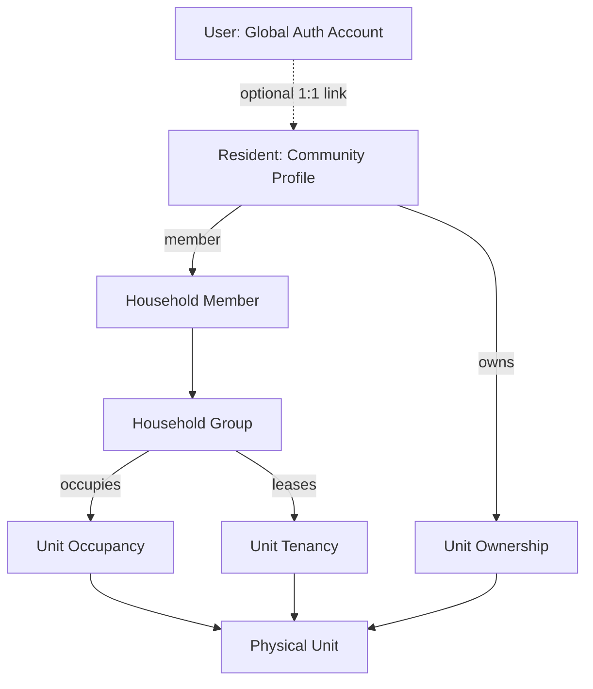

# Residential Domain Architecture

## 1. Executive Summary

The Community OS Residential Domain model connects physical Units with people while maintaining clean separation of concerns across authentication identity, residential profiles, household groupings, legal property titles, lease agreements, and physical occupancies.

---

## 2. Domain Concept Matrix

| Domain Concept        | Responsibility                                                               | Scope            | Account Required?              |
| :-------------------- | :--------------------------------------------------------------------------- | :--------------- | :----------------------------- |
| **`User`**            | Global login identity, credentials, JWT sessions, security audit log         | Platform-wide    | Yes                            |
| **`Resident`**        | Community residential person profile, name, contact info, preferred language | Community-scoped | No (can exist as profile-only) |
| **`Household`**       | Residential unit group associated with a physical unit over a time window    | Unit & Community | No                             |
| **`HouseholdMember`** | Association between Resident and Household with relationship type            | Household        | No                             |
| **`UnitOwnership`**   | Legal property ownership title, joint ownership shares, ownership type       | Unit & Community | No                             |
| **`UnitTenancy`**     | Rental lease agreement record, agreement reference, lease duration           | Unit & Community | No                             |
| **`UnitOccupancy`**   | Real-time physical occupancy tracking and overlap prevention                 | Unit & Community | No                             |

---

## 3. Critical Business Rules

1. **Owner $\neq$ Occupant**: An owner may own a unit without residing in it (e.g. an investor or non-resident owner). A tenant household may occupy the unit while ownership remains with the landlord.
2. **SaaS Multi-Tenancy $\neq$ Residential Tenancy**: Multi-tenancy in Community OS refers to logical isolation between Organizations and Communities (`organizationId`, `communityId`). Residential Tenancy refers to a rental lease relationship (`UnitTenancy`).
3. **Temporal Invariance & History**: Past occupancies, expired tenancies, and transferred ownership titles remain permanently queryable for audit, legal dispute resolution, and historical accounting.
4. **Effective-Dated Overlap Prevention**: No two active or scheduled occupancies on the same physical unit can overlap in effective date ranges.
