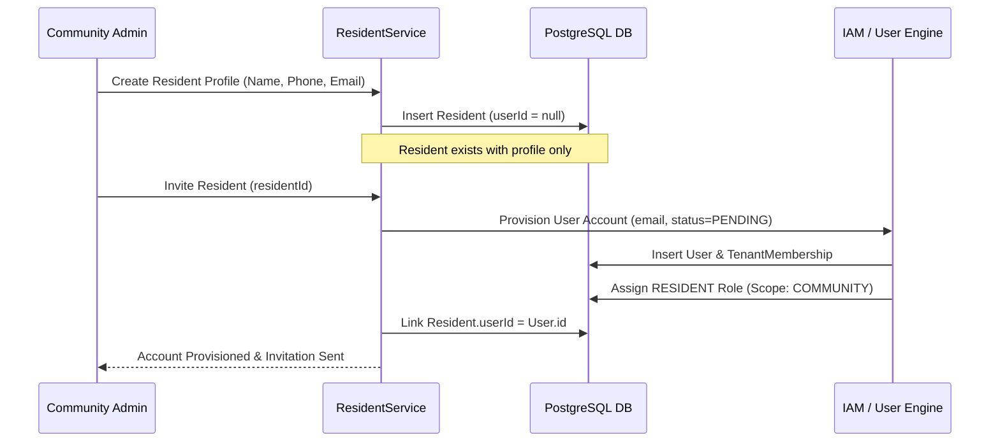

# Resident vs User Identity Separation

## 1. Architectural Motivation

In residential communities, many real-world residents cannot or should not have active login credentials in the system immediately upon registration:

- Minors and elderly family members.
- Non-app users whose information is recorded by property management.
- Domestic staff and caretakers.

If every resident required a user login account at creation time, onboarding would be bottlenecked on credential generation and identity verification.

---

## 2. Decoupled Lifecycle Architecture

---

## 3. Scoped Self-Access

When a `User` logs in with the `RESIDENT` role:

1. `UnitAccessResolver` checks if the user is linked to an active `Resident` profile that owns or occupies the unit.
2. The user is granted access **strictly to their own unit, own household, and own profile**.
3. Directory browsing and cross-unit access are denied by the authorization engine.
