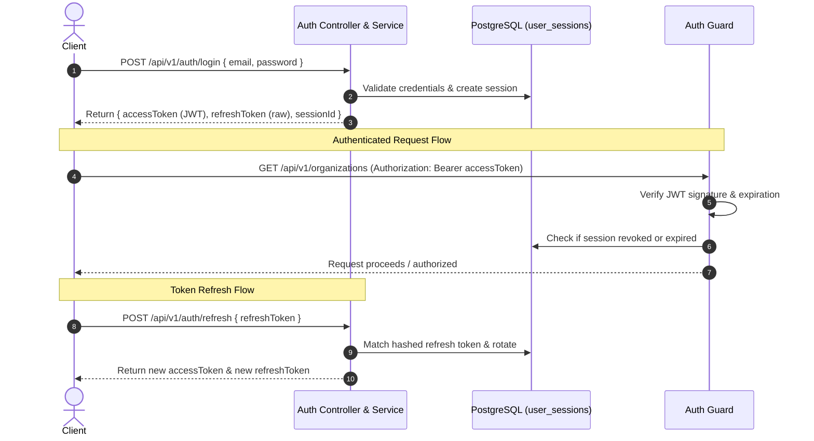

# Session Model & Token Lifecycle Specification

## 1. Hybrid Token-Session Model

Community OS utilizes a hybrid approach:

- **Stateless Tokens for Speed**: 15-minute JWT access tokens contain user claims and session IDs.
- **Server-Side Session Records for Control**: Every active login has a database record tracking the session status, device info, IP, last active timestamp, and hashed refresh token.

---

## 2. Session Lifecycle Flow

