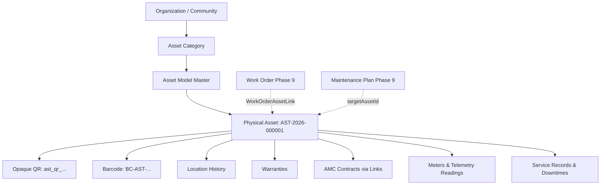

# Enterprise Asset Management Architecture (Phase 10)

## 1. Executive Summary & Domain Scope

Phase 10 establishes the **Enterprise Physical Asset Lifecycle Foundation** for Community OS.
It provides complete physical equipment asset registry, QR/barcode scanning passports, operational status tracking, hierarchical component trees, OEM warranties, Annual Maintenance Contracts (AMC/CMC), cumulative meter telemetry, and bi-directional integration with Facility Work Orders and Preventive Maintenance plans.

---

## 2. Core Domain Models

### 2.1 Asset Registry (`Asset`)

- **Identification**: Atomic human-readable code `AST-YYYY-######`, opaque QR identifier token `ast_qr_<hex>`, and optional barcode.
- **Classification**: Linked to `AssetCategory` (e.g. Electrical, HVAC, Plumbing) and optional catalog `AssetModel`.
- **Placement**: Polymorphic property link (`COMMUNITY`, `BUILDING`, `FLOOR`, `UNIT`, `OTHER`) with specific location descriptions.
- **Dual Status Model**:
  - `lifecycleState`: `REGISTERED`, `INSTALLED`, `COMMISSIONED`, `ACTIVE`, `SUSPENDED`, `DECOMMISSIONED`, `DISPOSED`.
  - `operationalStatus`: `OPERATIONAL`, `DEGRADED`, `UNDER_MAINTENANCE`, `OUT_OF_SERVICE`, `UNKNOWN`.
  - `condition`: `GOOD`, `FAIR`, `POOR`, `CRITICAL`, `UNKNOWN`.
  - `criticality`: `LOW`, `MEDIUM`, `HIGH`, `CRITICAL`.

### 2.2 Asset Hierarchy & Subcomponents

- Self-referencing `parentAssetId` modeling parent systems and maintainable child assemblies.
- Recursive cycle detection preventing invalid ancestor loops.
- Decommissioning guards requiring child resolution before parent retirement.

### 2.3 Cumulative Meters & Telemetry (`AssetMeter` & `AssetMeterReading`)

- Metric types: `RUN_HOURS`, `CYCLES`, `KWH`, `KM`, `PRESSURE`, `TEMPERATURE`, `CUSTOM`.
- Enforces strict monotonic progression with audit logging of positive deltas.
- Controlled reset capabilities for meter replacement or rollover.

### 2.4 Warranties & Service Contracts (`AssetWarranty` & `AssetServiceContract`)

- OEM warranty coverage dates, provider contacts, and terms documents.
- Multi-asset AMC/CMC contracts with SLA response/resolution guarantees, scheduled visit quotas, and parts/labor inclusions.
- Automated 30/60-day expiration alerts via background sweeper.

---

## 3. Integration with Facility Management (Phase 9) & Helpdesk (Phase 8)

1. **Ticket -> Work Order -> Asset Linkage**:
   - A resident complaint generates a helpdesk `Ticket`.
   - The ticket generates a physical `WorkOrder`.
   - The work order is linked to the physical `Asset` via `WorkOrderAssetLink`.
   - Upon completion, the work order logs an immutable `AssetServiceRecord` on the asset's service history.
2. **Preventive Maintenance Scheduling**:
   - `MaintenancePlan` targets specific assets via `targetAssetId`.
   - Cadence engine (Daily, Weekly, Monthly, Interval) automatically creates scheduled work orders pre-linked to the asset.

---

## 4. Security & Scanning Passport Model

1. **Opaque QR Resolution**:
   - Physical badges display an opaque QR token (`ast_qr_<hex>`).
   - Mobile camera or handheld scanner hits `GET /api/v1/asset-identifiers/qr/:token`.
   - Server checks membership and tenant scope, resolving asset metadata without exposing internal database IDs or sensitive PII.
2. **RBAC Scoped Permissions**:
   - `asset:view`, `asset:create`, `asset:update`, `asset:delete`, `asset:commission`, `asset:decommission`, `asset:meter_record`, `asset:contract_manage`.
