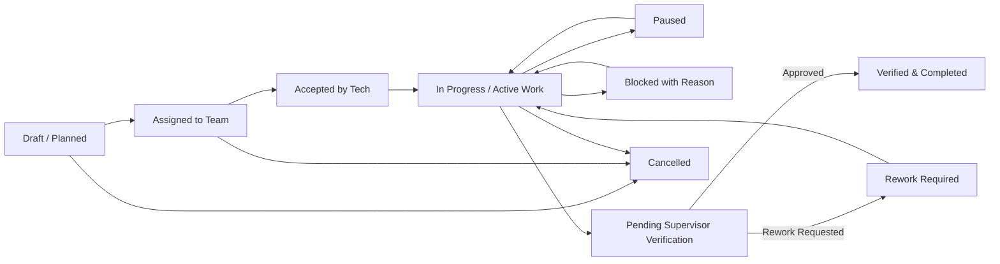

# Enterprise Facility Management & Work Execution Architecture

## 1. Executive Summary & Domain Mission

Phase 9 delivers the operational execution backbone of Community OS. While Phase 8 Helpdesk captures resident and staff reported complaints ("What was reported?"), Phase 9 governs the physical, scheduled, and emergency engineering work performed on site ("What actual work must be performed, by whom, where, when, and with what verified outcome?").

---

## 2. Core Architectural Principles & Invariants

### 2.1 Domain Boundary Invariant

- **Ticket != Work Order**: Tickets represent customer service interactions. Work Orders represent authorized operational execution.
- **Decoupled Lifecycle**: Completing a work order does not close a linked ticket automatically. A ticket can produce zero, one, or multiple work orders.
- **Privacy Boundary**: Internal labor timers, technician notes, and internal inspection results remain strictly inside the facility domain and are not exposed directly to residents.

### 2.2 Execution & Verification Loop

---

## 3. Subsystem Architecture

### 3.1 Preventive Maintenance & Idempotent Recurrence

- **Recurrence Engine**: Supports `DAILY`, `WEEKLY`, `MONTHLY`, `QUARTERLY`, `YEARLY` schedules with cron and interval calculations.
- **Deterministic Occurrence Keys**: `${planId}_${occurrenceAt.toISOString()}` ensures exactly-once execution across background worker retries.
- **Lead-Time Generation**: Advance generation enables procurement and labor scheduling prior to the scheduled due date.

### 3.2 Standardized Versioned Checklists

- Standardized templates with version control (`v1, v2, ...`).
- Snapshotted into work orders at creation time.
- Supports `BOOLEAN`, `PASS_FAIL`, `NUMBER`, `DECIMAL`, `TEXT`, `SELECT`, and `PHOTO_REQUIRED`.
- Quality gates block work completion if mandatory checklist items or photos are missing.

### 3.3 Labor Tracking & Live Timers

- Server-side timestamp persistence (`startedAt: now()`) calculates accurate duration upon stop.
- Enforces single-active-timer per technician to prevent overlapping labor records.
- Manual work logs supported with reason audit.

### 3.4 Operational KPI & Analytics

- Real-time aggregation of Open Work Orders, Unassigned Queue, In Progress, Blocked Items, Supervisor Review Queue, Overdue Items, and PM Compliance Rate.
- Fully integrated with Phase 7 SLA and Phase 5 Audit engines.

---

## 4. Architectural Decision Records (ADRs)

- [ADR 065: Work Order vs Ticket Strict Domain Boundary](../adr/065-work-order-vs-ticket-domain-boundary.md)
- [ADR 066: Multi-Attempt Supervisor Review and Rework Loop](../adr/066-multi-attempt-supervisor-review-and-rework-loop.md)
- [ADR 067: Deterministic Maintenance Occurrence Idempotency](../adr/067-deterministic-maintenance-occurrence-idempotency.md)
- [ADR 068: Server-Side Live Labor Timers and Single-Active-Timer Invariant](../adr/068-server-side-live-labor-timers-and-single-active-timer-invariant.md)
- [ADR 069: Versioned Standardized Inspection Checklist Runtime](../adr/069-versioned-standardized-inspection-checklist-runtime.md)
- [ADR 070: Concurrency-Safe Technician Self-Claim and Dispatch](../adr/070-concurrency-safe-technician-self-claim-and-dispatch.md)
- [ADR 071: Atomic Human-Readable Work Order Sequence Generation](../adr/071-atomic-human-readable-work-order-sequence-generation.md)
- [ADR 072: Maintenance Lead Time and Schedule Advance Generation](../adr/072-maintenance-lead-time-and-schedule-advance-generation.md)
- [ADR 073: Photographic Evidence and Document Attachment Auditability](../adr/073-photographic-evidence-and-document-attachment-auditability.md)
- [ADR 074: Facility KPI Aggregation and SLA Operational Reporting](../adr/074-facility-kpi-aggregation-and-sla-operational-reporting.md)
