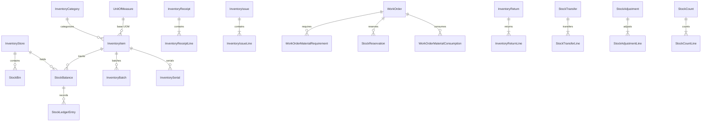

# Community OS: Enterprise Inventory & Stores Management Architecture

## 1. Executive Summary & Core Philosophy

The **Enterprise Inventory & Stores Management** system in Community OS provides a mission-critical physical stock accounting and spare parts supply-chain engine for residential communities and commercial facilities.

### Core Architecture Invariants:

1. **Inventory Item vs. Physical Asset Distinction (ADR-085)**:
   - **Asset**: Individually identifiable durable capital equipment (e.g. DG Set #1, Lift #3, Chiller #2) with service history, warranties, and runtime meters.
   - **Inventory Item**: Quantified stock, spare parts, and consumable materials (e.g. bearings, valves, copper wire, motor oil, fuses) tracked by unit count, weight, or volume across physical storage locations.
2. **Double-Entry Style Ledger-First Truth (ADR-086)**:
   - All physical inventory alterations originate as immutable `StockLedgerEntry` records with signed deltas.
   - `StockBalance` is a transactionally synchronized read projection with row-level locks, guaranteeing zero lost updates or race conditions.
3. **Two-Phase Stock Reservation (ADR-088)**:
   - Scheduled work orders place reservations on stock, adjusting `quantityReserved` and `quantityAvailable` without changing physical `quantityOnHand`.
4. **Decoupled Field Material Flow (ADR-089)**:
   - `Requirement -> Reservation -> Issue -> Consumption -> Return`.
   - Material is issued to a technician (reducing store stock), consumed upon actual installation/use, and any remainder is returned to the store via explicit return records.
5. **Batch/FEFO & Serial Control (ADR-090, ADR-091)**:
   - Automated First-Expiry-First-Out picking suggestions for perishable items.
   - Exact physical serial verification for high-value components.

---

## 2. Entity Relationship Overview

---

## 3. Stock Transaction Types & Ledger Invariants

| Transaction Type             | On-Hand Delta       | Reserved Delta | Available Delta     | Typical Reference Document  |
| :--------------------------- | :------------------ | :------------- | :------------------ | :-------------------------- |
| **OPENING_BALANCE**          | +Qty                | 0              | +Qty                | InventoryReceipt (OPENING)  |
| **RECEIPT**                  | +Qty                | 0              | +Qty                | InventoryReceipt (POSTED)   |
| **RESERVATION**              | 0                   | +Qty           | -Qty                | StockReservation (ACTIVE)   |
| **RESERVATION_RELEASE**      | 0                   | -Qty           | +Qty                | StockReservation (RELEASED) |
| **ISSUE (from Reservation)** | -Qty                | -Qty           | 0                   | InventoryIssue (POSTED)     |
| **ISSUE (direct)**           | -Qty                | 0              | -Qty                | InventoryIssue (POSTED)     |
| **RETURN**                   | +Qty                | 0              | +Qty                | InventoryReturn (POSTED)    |
| **TRANSFER_OUT**             | -Qty                | 0              | -Qty                | StockTransfer (DISPATCHED)  |
| **TRANSFER_IN**              | +Qty                | 0              | +Qty                | StockTransfer (RECEIVED)    |
| **ADJUSTMENT_IN**            | +Qty                | 0              | +Qty                | StockAdjustment (POSTED)    |
| **ADJUSTMENT_OUT**           | -Qty                | 0              | -Qty                | StockAdjustment (POSTED)    |
| **COUNT_RECONCILIATION**     | +/-Variance         | 0              | +/-Variance         | StockCount (POSTED)         |
| **REVERSAL**                 | Inverse of original | 0              | Inverse of original | Reversal Transaction        |

---

## 4. API Endpoints Reference

### Item Master & Taxonomy

- `GET /api/v1/inventory-items` — Filter items by category, type, store, status
- `POST /api/v1/inventory-items` — Create new item master record
- `GET /api/v1/inventory-items/:id` — Item details with multi-store balance & batch breakdown
- `PUT /api/v1/inventory-items/:id` — Update item specifications & store policies
- `GET /api/v1/inventory-categories` — Hierarchical category taxonomy
- `GET /api/v1/inventory-uoms` — Unit of measure catalog & precision conversion rates

### Stores & Stock Balances

- `GET /api/v1/inventory-stores` — List warehouses & maintenance sub-stores
- `POST /api/v1/inventory-stores` — Create warehouse / storage facility
- `GET /api/v1/stock-balances` — Multi-store stock matrix with on-hand, reserved, available levels
- `GET /api/v1/stock-ledger` — Immutable historical audit ledger

### Inward Receipts & Material Dispatch

- `POST /api/v1/inventory-receipts` — Create draft goods receipt
- `POST /api/v1/inventory-receipts/:id/post` — Post receipt (atomic ledger & balance increment)
- `POST /api/v1/inventory-receipts/:id/reverse` — Reverse posted receipt with reason
- `POST /api/v1/inventory-issues` — Create material issue dispatch for Work Order / Operations
- `POST /api/v1/inventory-issues/:id/post` — Post issue (atomic ledger & stock reduction)

### Work Order Material Integration

- `GET /api/v1/work-orders/:id/materials` — Full material status (required, reserved, issued, consumed, returned)
- `POST /api/v1/work-orders/:id/material-requirements` — Plan required spare parts
- `POST /api/v1/work-orders/:id/materials/reserve` — Reserve stock for scheduled maintenance
- `POST /api/v1/work-orders/:id/materials/consume` — Record actual installed/utilized spare parts
- `POST /api/v1/work-orders/:id/materials/return` — Return unused items to store

### Physical Stock Counts & Reconciliation

- `POST /api/v1/stock-counts` — Initialize stock count with system snapshot
- `POST /api/v1/stock-counts/:id/record` — Record physical counts per bin/item
- `POST /api/v1/stock-counts/:id/submit` — Submit count for review
- `POST /api/v1/stock-counts/:id/post` — Post variance reconciliation ledger entries
